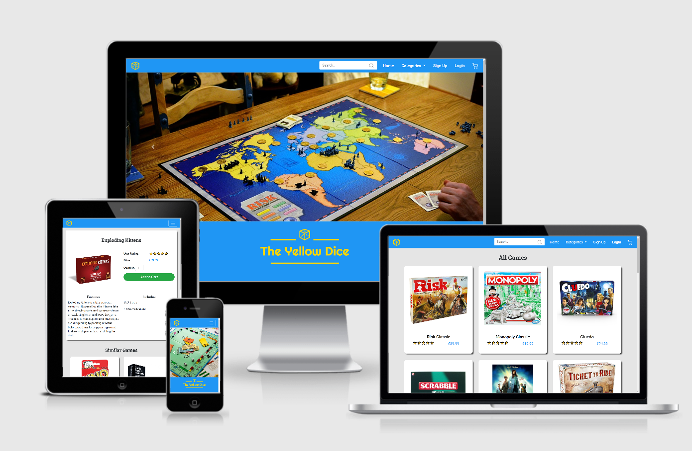

# [The Yellow Dice](https://the-yellow-dice.herokuapp.com/)

An ecommerce website that sells tapletop games made with Django

## Table of Contents
1. [**UX**](#ux)
    - [**User Goals**](#user-goals)
    - [**User Stories**](#user-stories)
    - [**Design Choices**](#design-choices)
    - [**Wireframes**](#wireframes)

2. [**Features**](#features)
    - [**Existing Features**](#existing-features)
    - [**Features Left to Implement**](#features-left-to-implement)

3. [**Technologies Used**](#technologies-used)

4. [**Testing**](#testing)
    - [**Tested Devices**](#tested-devices)
    - [**Simulated Devices**](#simulated-devices)
    - [**Manual Testing**](#manual-testing)
    - [**Validation Services**](#validation-services)
    - [**Bugs Discovered**](#bugs-discovered)

### 

6. [**Deployment**](#deployment)
    - [**How to run this project locally**](#how-to-run-this-project-locally)
    - [**Heroku Deployment**](#heroku-deployment)

7. [**Credits**](#credits)
    - [**Code**](#code)
    - [**Media**](#media)
    - [**Acknowledgments**](#acknowledgments)

8. [**Disclaimer**](#disclaimer)

## UX

### User Goals

| As a user of the site, I want to be able to:                                                                     | The Yellow Dice meets these needs by:                                                                           |
|------------------------------------------------------------------------------------------------------------------|-----------------------------------------------------------------------------------------------------------------|
| Easily understand how to use the site.                                                                           | Having a clear user interface and providing visual feedback to user actions.                                    |
| Choose between various categories of tabletop games.                                                             | Allowing to browse through 4 game categories: Board Games, Cards, Abstract and, Mash-Up.                        |
| Search the site for a specific feature or game element, for example cards or dice.                               | Having a search function that goes through the game title, its description and the items included in the box.   |
| Choose games similar to those I already know and have enjoyed.                                                   | Suggesting a list of similar games each time the user selects a game.                                           |
| Use the site from my smartphone as well as my tablet and my laptop.                                              | Being fully responsive, having been created following the mobile-first approach.                                |
| Register an account with my shipping details so that I don't have to re-enter them every time I make a purchase. | Providing a form in which to enter or modify relevant information.                                              |
| Make a one-time purchase with no need to register an account.                                                    | Making the account registration optional.                                                                       |
| Complete each purchase quickly and easily.                                                                       | Providing a minimal checkout page with no distractions that can divert the user's attention.                    |
| See my order history.                                                                                            | Providing a detailed list of orders placed.                                                                     |

### User Stories

### Design Choices

#### Fonts  
All fonts are from [Google Fonts](https://fonts.google.com/).  
- _Roboto_: Site main font, it was chosen for its clear and straight design.  
- _Roboto Slab_: A more stylized version of Roboto, used in page headers.
- _Righteous_: Used in the logo, chosen for its distinctiveness and ease of reading.

#### Color Palette
The site uses light, pastel colors with good contrast between them.
- _Gold Yellow (#FFD700)_: Chosen to create the logo, also used to highlight the hovered navbar elements.
- _Sky Blue (#1F96F4)_: Used for the navbar, footer, and logo background, it was chosen to create a nice contrast with the yellow of the logo.
- _Light Gray (#E5E5E5)_: Used for the site background.
- _Dark Gray (#99999)_: Used for the placeholder text in forms and searchbar.  
- _Bootstrap Green (#5cb85c)_: Used for most of the buttons on the site.
- _Bootstrap Red (#d9534f)_: Used for the "remove from cart" buttons.

#### Icons  
All icons are from [Feather Icons](https://feathericons.com/).  
- _Cart Icon_: The cart icon is easily reachable from any part of the site, being placed in the right corner of the navbar, as it is conventionally used in this type of site and is where the user expects to find it.
- _Cart Operations_: Icons are used to manage cart operations (add item, change quantity, and delete item), with easily recognizable symbols that communicate their meaning in a more intuitive way than the written text. 
- _Site Navigation_: Icons have also been added to navigation buttons as visual clues to facilitate site navigation.
- _Social Media Icons_: Placed in the footer to give access to the 3 main social media: Facebook, Instagram, and Twitter.

### Wireframes  
  
The wireframes were created using [Figma](https://www.figma.com/) and can be found [here](https://www.figma.com/file/c22Y7U3hy37bp4gazuvnpb/Forth-Milestone-Project?node-id=0%3A1.)

## Features

### Existing Features

### Features Left to Implement

## Technologies Used
  
#### Languages  
- [HTML5](https://devdocs.io/html/)
- [CSS3](https://devdocs.io/css/) 
- [JavaScript](https://devdocs.io/javascript/)
- [Python](https://www.python.org/)

#### Frameworks  
- [Django](https://www.djangoproject.com/) to construct and render pages.
- [Bootstrap](https://getbootstrap.com/) to create the responsive design.  

#### Libraries
- [JQuery](https://jquery.com) to simplify DOM manipulation.  
- [Google Fonts](https://fonts.google.com/) to import the fonts used on the website.  
- [Feather Icons](https://feathericons.com/) to import the icons used on the website.  
- [Django Crispy Forms](https://django-crispy-forms.readthedocs.io/en/latest/) to style django forms. 
- [Gunicorn](https://pypi.org/project/gunicorn/) to aid in deployment of the Django project to heroku.
- [Pillow](https://pillow.readthedocs.io/en/stable/) as Python imaging library to aid in processing image files to store in database.
- [Psycopg2](https://pypi.org/project/psycopg2/) as PostgreSQL database adapter for Python.
- [Boto3](https://boto3.amazonaws.com/v1/documentation/api/latest/index.html) to enable creation, configuration and management of AWS S3.

#### Databases  
- [SQLite](https://www.sqlite.org/index.html) as development database.
- [PostgreSQL](https://www.postgresql.org/) as production database.  

#### Services
- [GitPod](https://www.gitpod.io/) was the main IDE in which the project was developed.  
- [Git](https://git-scm.com/) for version control during the development process.  
- [GitHub](https://github.com/) to host the project in a remote repository.  
- [Heroku](https://dashboard.heroku.com/apps) to deploy the project.  
- [Chrome DevTools](https://developers.google.com/web/tools/chrome-devtools) to test responsiveness and quickly debug code.  
- [HTML Validator](https://validator.w3.org/) to test the HTML code.  
- [CSS Validator](https://jigsaw.w3.org/css-validator/) to test the CSS code.  
- [JSHint](https://jshint.com/) to test the JavaScript code.  
- [Python syntax checker](https://extendsclass.com/python-tester.html) to test the Python code.
- [Autoprefixer](https://autoprefixer.github.io/) to add prefixes in the CSS for cross-browser support.  
- [Figma](https://www.figma.com/) for wireframing.
- [Stripe](https://stripe.com/en-ie) as payment platform to validate and accept credit card payments securely.
- [AWS S3](https://aws.amazon.com/) to store images and static files.
- [BrowserStack](https://www.browserstack.com/) to test multiple devices and browsers.
- [Am I Responsive?](http://ami.responsivedesign.is/) to take the [screenshot](#open-trailer) placed at the beginning of this document. 

#### Software
- [Paint.net](https://www.getpaint.net/) to simple image manipulation.
- [Visual Studio Code](https://code.visualstudio.com/) for testing snippet of JS code.
- [Spyder](https://www.spyder-ide.org/) for testing snippet of Python code.  

## Testing  
  
### Tested Devices  
The website has been successfully tested with the following devices, plus all those simulated by the [Chrome DevTools](https://developers.google.com/web/tools/chrome-devtools).    
  

| Type       | Device                      | Browsers                     |  
| -----------|---------------------------- |------------------------------|  
| Laptop     | Asus FX753VD                | Chrome, Firefox, Edge, Opera |  
| Smartphone | Lenovo Moto G5S Plus        | Chrome, Firefox              |  
| Smartphone | Samsung Galaxy note 10 plus | Chrome                       |  
| Smartphone | Samsung Galaxy s9           | Chrome                       |  
| Smartphone | Samsung Galaxy a50          | Firefox Focus                |  
| Smartphone | Asus ZenFone 4 max          | Chrome                       |  
| Smartphone | Apple iPhone 7              | Safari                       |   

  
### Manual Testing
  
### Validation services  
  
### Bugs Discovered  

## Deployment  
  
### How to run this project locally  
  
## Credits  
  
### Code  
  
### Media  
  
### Acknowledgments 

   
  
#### Disclaimer  
  